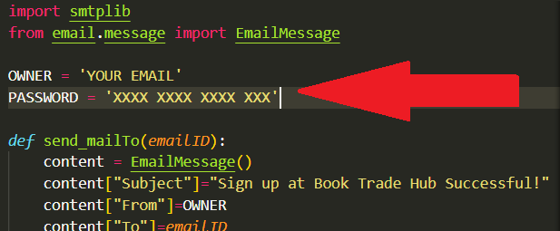

<div style="background-color: grey; text-align: center;">
    
</div>

# About this project
BTH - is a platform to provide a place for students in the college campus to put their books up for trade. It encourages students to read more and brings together like-minded people.

> Learn to let go<br>&nbsp;&nbsp;&nbsp;&nbsp;&nbsp;&nbsp;&nbsp;&nbsp;&nbsp;&nbsp;&nbsp;&nbsp;&nbsp;&nbsp;&nbsp;&nbsp;&nbsp;&nbsp;&nbsp;&nbsp;&nbsp;&nbsp;&nbsp;&nbsp;-someone wise

Trade your books, trade your knowledge. Help others grow, grow yourself.

<div style="text-align: center;"><i>This is my motto of this project</i></div>


<br>
<br>
It is a flask based project and database as sqlite3 (hoping to switch it over to a cloud based database and deploy it)

## Few things to note when running it locally
1) make sure to add your email ID (admin email that is) and the password for it.
If you have 2 factor authentication on. You would need to get a 16 character long password from your gmail.
<br>
You can follow this guide: https://www.123formbuilder.com/docs/setting-up-smtp-with-2-step-verification-on/

2) Update these in the `modooles/maily.py`


3) Download the required modules-
```sh
pip install -r req.txt
```

4) go to `http://localhost:5000`


## Final words

This project was built as a passtime for me. Alas, if anyone would like to contribute in anyway, it is very much appreciated. If you have made it this far reading it, thank you.